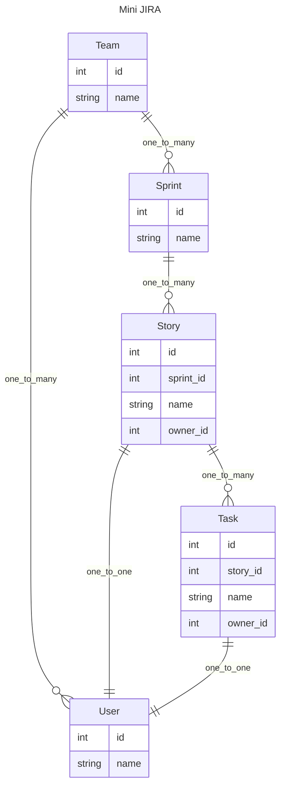

# Composable API Development Pattern  (WIP)
When building an API for relational data, is there a solution that balances flexibility, performance, and maintainability when dealing with nested data?

It should be able to support the following features:

- Asynchronous operations
- Define multi-level data structures in a concise and easy-to-extend manner, especially for expanding associated data
- Pass global parameters to descendant nodes
- Ability to manipulate data after each layer's resolve operation
- Select specific fields to return
- Ability to build data from descendant nodes up the hierarchy
- Avoid performance issues related to N+1 queries
- Friendly error messages for easy debugging

This repository will implement a composable API development pattern using pydantic2-resolve and some conventions through a series of examples.

## Roadmap:
- Simple list
- Nested list
- Multi-level nested list
- Reuse of Dataloader
- Various configurations & use cases
- Preloading with Dataloader
- Conventions for composable patterns


## Building a Mini JIRA API
Let's start by building a mini JIRA system.

The mini-jira system has the following entity concepts, which are distributed across various services.



## running the code

```shell
python -m venv venv
source venv/bin/activate
pip install -r requirement.txt
uvicorn src.main:app --port=8000 --reload
# http://localhost:8000/docs
```

folder structure

- src 
    - routers
        - sample_1
            - router.py
            - schema.py // composed schema
        - sample_2
    - services
        - user
            - query.py // basic queries
            - loader.py  // dataloaders
            - model.py // sqlalchemy orm
            - schema.py  // base schema
            - mock.py
        - task
        - ...
    - main.py


## Simple List
Corresponding routes:

- sample_1.router:get_users
- sample_1.router:get_tasks

In src.router.sample_1, we create APIs for users and tasks, which return lists of type list[T].


```python
import src.services.task.query as tq

@route.get('/tasks', response_model=List[ts.Task])
async def get_step_1_tasks(session: AsyncSession = Depends(db.get_session)):
    """ 1.2 return list of tasks """
    return await tq.get_tasks(session)
```
