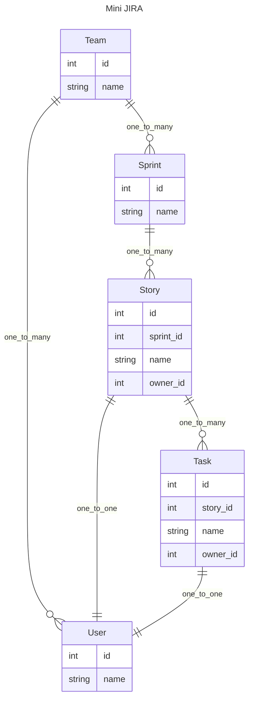

# 面向组合的 API 开发模式 - 也许你并不需要 GraphQL

在构建 API 时, 数据的拼接和调整一直是比较头疼的问题. 

过程式的数据处理对调整不友好, 循环和拼接容易产生不易维护的代码. GraphQL 带来的, 通过声明描述数据结构是一个好的方向.

GraphQL 的亮点是通过 Query 确定查询结构, 一层层驱动后端的 resolver 来构造数据.

但完整的引入 GraphQL 对架构调整的侵入不小, 而且其自身也存在一系列的问题, 例如:

- 无法描述尺寸不确定的递归结构
- key 不确定的 Dict 结构
- Query 语句在Schema 变化后有维护成本
- 权限控制, 速率控制等问题, Schema 可能暴露过多信息.
- Query 比较复杂的话, 性能问题不容易优化.
- 无法对查询到达数据做比较精细的后期处理 (middleware 的入口是query 的顶层)
- Schema 复杂之后, 容易出现复用代码的管理困难.

对于一个有历史抱负的项目, 引入GraphQL 对前后端的改动成本也很客观. 

另外, 从架构分层的角度来看, 引入 GraphQL 的代表着后端和前端的关系, 从以往多个确定的接口, 变成了不可预测使用场景的单一接口. 这就导致前端对后端之间的依赖关系变得不清晰了(失去了感知), 后端只能以面向一组"可能的查询组合" 为目标来做开发. 在这种对前端使用方式失去感知的情况下, 接口调整的成本会显著上升. 重构能力也就下降了.

> 因此会看到有些GraphQL设计得就像一个个独立的API一样, 就是为了将各个接口之间区分开, 并且减少之间的深层schema 耦合. 
>
> 自由的组合虽然很理想, 但现实迭代和维护成本还是很骨感的. 从维护的角度来说, 显示的声明总是优于隐式申明.

## 什么是面向组合的模式?

通过思考我们发现, GraphQL 最大的魅力是可以为前端构造方便渲染的组合体数据, 那么如果我们抛开 Query 这个环节, 直接让单个API 也可以返回相似的数据, 那么我们就可以在不引入 GraphQL 一整套体系的情况下, 也能使用传统 RESTful 接口来提供组合好的数据了. 还能避免上述 GraphQL 的问题, 并且把前端数据处理的工作量尽量减少到最小. 

这个模式下, 后端虽然不像 GraphQL 那样 "无所事事", 但可以获得对接口比较高的"控制权",  而且对已有架构的影响也不大, 本身输出嵌套的json 都是所有框架具备的能力. 

设想在后端有一种类似 GraphQL query 一样的 schema 声明手段, 只要申明完毕 schema, 就能自动将数据生成出来, 这样就能保证开发效率, 并且维护了后端对前端具体使用的"感知", 架构的依赖关系保持了清晰.

> 我们有了一个 API 提供一个page 所需所有数据的能力, 这让前后端接口关系变得更清晰.

罗列一下, 这样的一个开发模式需要有以下这些能力:

- 可以方便的描述组合体数据的 schema, 然后resolve出完整数据, 定义方式简单
- 各个 service 仅需提供通用的 loader, 服务于数据拼装
- 读取全局参数, 读取祖先节点数据
- 每层 `resolve` 完子孙数据后, 有 post 方法来操作数据
- 可以挑选所需的字段
- 支持异步
- 避免 N+1 查询相关的性能问题
- 友好的错误提醒, 方便 debug
- 保证前后端对修改的感知能力, 易于修改重构 (借助OpenAPI)


下图简单的展示了组合模式的关系, 分为 service 和 router 两个部分.

- service 负责一个个具体业务对象, 对外提供业务`query` 以及通用的数据 `loader`. 
- router 负责拼接 `schema`, 然后将 `query` 提供的核心数据, 通过自动解析, 生成完整的数据.


本 repo 会通过一系列的例子, 结合 `pydantic2-resolve` 和一些约定, 来介绍这么一套面向组合的 API 开发模式.

- https://github.com/allmonday/pydantic2-resolve


## 示例：搭建 Mini JIRA API



Mini jira 包含了常见的敏捷开发中的各种概念和其之间的关系.

我们将通过各种 `router/schema` 来描述并获得我们期望的数据结构, 这个过程将非常简洁.

比如下例中, 通过定义 Sample1StoryDetail 来生成 story -> task -> user 这样的多层数据.

```python
from typing import Optional
from pydantic2_resolve import LoaderDepend as LD

# loaders
import src.services.task.loader as tl
import src.services.user.loader as ul

# schemas
import src.services.story.schema as ss
import src.services.task.schema as ts

# compose together
class Sample1TaskDetail(ts.Task):
    user: Optional[us.User] = None
    def resolve_user(self, loader=LD(ul.user_batch_loader)):
        return loader.load(self.owner_id)

class Sample1StoryDetail(ss.Story):
    tasks: list[Sample1TaskDetail] = []
    def resolve_tasks(self, loader=LD(tl.story_to_task_loader)):
        return loader.load(self.id)

    owner: Optional[us.User] = None
    def resolve_owner(self, loader=LD(ul.user_batch_loader)):
        return loader.load(self.owner_id)

# query
@route.get('/stories-with-detail', response_model=List[Sample1StoryDetail])
async def get_stories_with_detail(session: AsyncSession = Depends(db.get_session)):
    stories = await sq.get_stories(session)
    stories = [Sample1StoryDetail.model_validate(t) for t in stories]
    stories = await Resolver().resolve(stories)
    return stories
```

具体请参看 router 下的一系列 sample_x 或者滚动到底部阅读文档.


## 执行代码

```shell
python -m venv venv
source venv/bin/activate
pip install -r requirement.txt
uvicorn src.main:app --port=8000 --reload
# http://localhost:8000/docs
```

可以在 swagger 中执行查看每个 API 的返回值

## 功能介绍

- [多层嵌套结构的构建](./src/router/sample_1/readme-cn.md)
- [Loader 中对数据过滤](./src/router/sample_2/readme-cn.md)
- [将字段暴露给子孙节点](./src/router/sample_3/readme-cn.md)
- [在resolve 结束后, 对获取数据的后处理](./src/router/sample_4/readme-cn.md)
- [Context 和schema得复用](./src/router/sample_5/readme-cn.md)
- [挑选需要返回的字段](./src/router/sample_6/readme-cn.md)
- [操作 Loader 实例](./src/router/sample_7/readme-cn.md)
- [用 service 测试代替 API 测试-wip](./src/services/sprint/readme-cn.md)
- [和 GraphQL 比较](./resolve-vs-graphql-cn.md)
