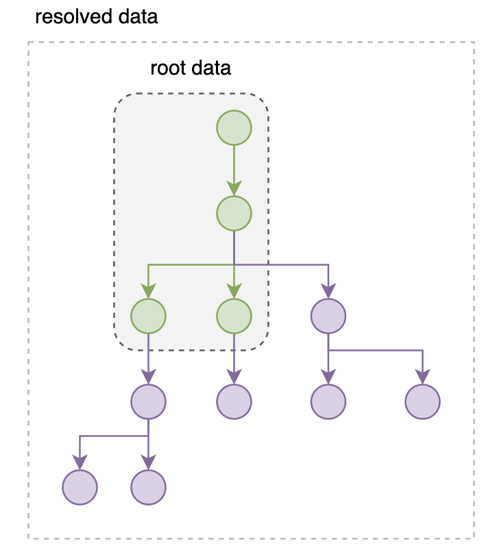
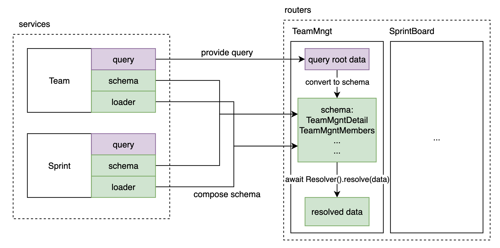
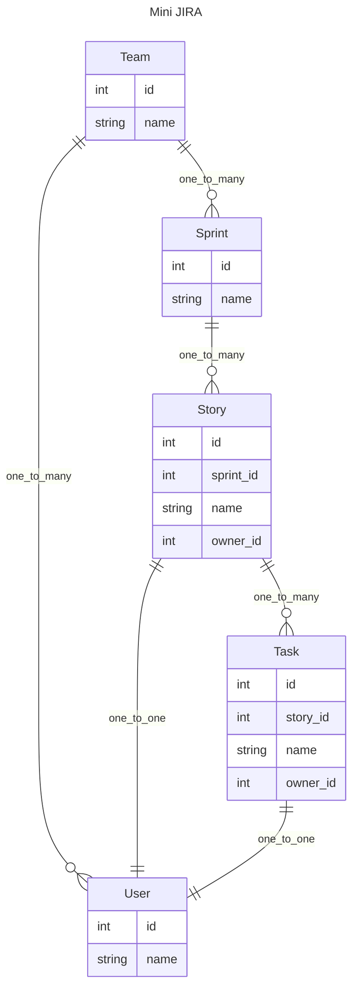

# 面向组合的 API 开发模式

构建面向视图的数据时, 不可避免会出现数据拼接的需求.

```json
[
  {
    "id": 1,
    "team": "a",
    "members": [
      {
        "id": 1,
        "name": "kikodo",
        "task": [
          {
            "id": 1,
            "name": "complete tutorial"
          }
        ]
      }
    ],
  }
]
```

根据视图数据的复杂程度, 拼接的难度会有很大的差异.

在处理手段上来讲, 通常的做法是手动循环拼接. 

```python
# 伪代码
task_map = group_by_member_id(tasks)
member_map = group_by_team_id(members)

for m in members:
  m.tasks = task_map[m.id]
for t in teams:
  t.members = member_map[t.id]
...
```

> 或者在一些特定场景下借助 ORM 来处理relationship 关系的查询.

过程式的数据处理对调整和阅读都不友好, 循环和拼接容易产生不通用和不易维护的代码. 添加和修改字段也很麻烦.

GraphQL 带来的通过声明描述数据结构是一个好的方向, Graph Query Language, 作为一种声明式的查询语言, 服务于一系列关系型资源的获取和组合.  其查询语句能展示期望的数据结构. 

```gql
{
  project(name: "GraphQL") {
    tagline
  }
}
```

背后的Query定义也是用申明的方式来描述(可能用来查询的)数据结构.

```js
// schema first
var schema = buildSchema(`
  type Query {
    hello: String
  }
`)

var rootValue = {
  hello: () => {
    return "Hello world!"
  },
}
```

graphene 的会更加形象一些.

```python
# code first
from graphene import ObjectType, String, Schema

class Query(ObjectType):
    hello = String(first_name=String(default_value="stranger"))

    def resolve_hello(root, info, first_name):
        return f'Hello {first_name}!'
```

一段复杂的GraphQL query 查询结果和一段复杂的 ORM 查询是类似的. 只是GraphQL 借助dataloader更擅长关联数据. 可以更加直观地构造多层的视图数据.

GraphQL 虽好, 但完整引入 GraphQL 对架构的影响不小, schema 定义之类的都要跟随调整. 而且其自身也存在一系列的问题, 例如:
- 无法描述尺寸不确定的递归结构
- key 不确定的 Dict 结构
- Query 比较复杂的话, 性能问题不容易优化.
- 数据的后处理不方便
- 要使用它定义的一套类型


> 个人认为, 从定位上来说, GraphQL 用来给项目的前端提供数据其实是一种错误的用法, 它的定位和 SQL 是类似的, 为服务端获取数据提供便利. 这样就可以不用考虑权限, 限速等接口层问题. 
>
> 现在很多前端直接使用 GraphQL 来组合查询, 从职位划分来说等于插手了一部分后端的工作. 把GraphQL 放在 client 和 server 之间并不是一个理想的定位. 就像把 SQL 查询暴露给 client 一样. (数据的处理分散在多个环节不利于项目维护.)


总体来说, GraphQL 在提供视图数据方面, 有查询灵活度高的优点, 但存在获取的数据后期调整比较麻烦, 以及架构侵入较大等缺点. 比如 GraphQL 获取到多层数据后要做层级聚合统计, 就需要重新遍历一遍树状数据来处理. 框架本身没有设计合适的下层数据处理完之后触发回调的钩子. (这恰恰是对视图调整很有用的)

在这里我们总结一下, 从数据获取到生成视图需要哪几个步骤.

1. 查询, 可能是多组数据, 也可能已经是嵌套数据
2. 数据拼接 (optinal), 根据 1 来决定是否需要 (GraphQL可以很大程度跳过这一步.)
3. 业务转换: 对查到的数据做调整, 比如计算数组长度, 额外过滤, 业务转换等等, 构造出前端直接可以使用的数据. (这种具体业务逻辑不适合在GraphQL中操作, 因此需要单独处理.)

思考后会发现, 比起 GraphQL 那个灵活的查询组合功能, 在处理视图数据的时候, GraphQL 最大的优势是他申明式的数据描述方式.

以 graphene-python 为例, Query对象可以支持灵活的 GraphQL 查询, 比如挑选字段, 或者重命名等等.

```python
from graphene import ObjectType, String, Schema

class Query(ObjectType):
    hello = String(first_name=String(default_value="stranger"))
    goodbye = String()

    def resolve_hello(root, info, first_name):
        return f'Hello {first_name}!'

    def resolve_goodbye(root, info):
        return 'See ya!'
schema = Schema(query=Query)

query_with_argument = '{ hello(firstName: "GraphQL") }'
result = schema.execute(query_with_argument)
print(result.data['hello'])
```

那如果我不去编写查询, 而是直接把 Query 直接变成一个服务于固定业务的视图数据描述:

借助 pydantic 强大的类型转换和检查的功能, 来实现申明式的数据结构描述.

```python
from pydantic import BaseModel
from pydantic_resolve import Resolver

class HelloGoodByeView(BaseModel):
  hello: str = ''
  def resolve_hello(self, context):
    return f"Hello {context['first_name']}"

  goodbye: str = ''
  def resolve_goodbye(self):
    return 'See ya'

  def post_goodbye(self):
    return 'See ya soon'  # will alter the self.goodbye.

async def main():
  hgv = HelloGoodByeView()
  return await Resolver(context={'first_name': 'tangkikodo'}).resolve(hgv)
```

**优点是把大而全的单一查询入口, 替换成了一个个小巧灵活的定制化 schema 描述.**

结合那三个步骤, `pydantic-resolve` 可以做到:

1. 查询. 可以层层查询 (dataloader), 也可以一次性从树状数据加载 (GraphQL or ORM 查询结果).
2. ~~数据拼接~~ 
3. 业务转换: 利用post_method 和 exclude 方法, 可以在每一层灵活处理数据

## 什么是面向组合的模式?

面向组合的开发模式就是在声明式描述期望视图结构的基础上, 逐步扩展出来的一套开发模式. 

它在架构上的优点是, 通过申明式的 schema 定义, 让数据拼接过程变得更加直接和容易调整. 

它让 service 层保持简洁, 大多数情况下只需要提供简单的查询就能满足拼接的需要, 避免了拼接逻辑侵入到 service 的情况.

它的核心概念是: 

先定义好视图结构, 然后获取`根数据`(树干), 再让`Resolver`从树干解析出来所有的数据 (树枝,树叶).



> 根数据本身当然也可以是嵌套的结构

罗列一下, 这套开发模式有以下这些优点:

- 查询
  - 用申明式的方式描述数据和查询, 直观且容易修改
  - 可以读取全局参数, 可以跨层级向下传递数据
  - 任意层级, 任意类型.
  - 架构简单, 各个 service 仅需提供通用的 loader, 用于数据拼装
- 修改
  - 每一层都有后处理数据的能力
  - 可以挑选所需的字段
  - 调整视图数据很容易, 让前端真正做到开箱即用.
- 性能
  - 解决 N+1 查询相关的性能问题
  - 对优化友好, 只要保证输出一致, 内部重构对API使用者无感.
- 其他
  - 借助OpenAPI, 前端对后端操作简化为sdk 方法调用.


> 可以很容易联想到, 我们获得了一个 API 提供一个page 所需数据的能力, 这会让前后端接口关系变得更简单.
> 
> 就像前端通过 GraphQL 实现的那样, 而且更简单, 不用写额外查询, 直接一个简单请求就行.

下图简单的展示了组合模式的关系, 分为 service 和 router 两个部分.

- service 负责一个个具体业务对象, 对外提供业务`query` 以及通用的数据 `loader`. 
- router 负责声明 `schema`



本 repo 会通过一系列的例子, 结合 `pydantic2-resolve` 和一些约定, 来介绍这么一套面向组合的 API 开发模式.

- https://github.com/allmonday/pydantic2-resolve


## 示例：搭建 Mini JIRA API



Mini jira 包含了常见的敏捷开发中的各种概念和其之间的关系.

我们将通过各种 `router/schema` 来描述并获得我们期望的数据结构, 这个过程将非常简洁.

比如下例中, 通过定义 Sample1StoryDetail 来生成 story -> task -> user 这样的多层数据.

只需要描述好 Task 要扩展的字段, Story 要扩展的字段, 然后 Resolver 就会帮你处理完后续的所有事情.

```python
from typing import Optional
from pydantic2_resolve import LoaderDepend as LD

# loaders
import src.services.task.loader as tl
import src.services.user.loader as ul

# schemas
import src.services.story.schema as ss
import src.services.task.schema as ts

# compose together
class Sample1TaskDetail(ts.Task):
    user: Optional[us.User] = None
    def resolve_user(self, loader=LD(ul.user_batch_loader)):
        return loader.load(self.owner_id)

class Sample1StoryDetail(ss.Story):
    tasks: list[Sample1TaskDetail] = []
    def resolve_tasks(self, loader=LD(tl.story_to_task_loader)):
        return loader.load(self.id)

    owner: Optional[us.User] = None
    def resolve_owner(self, loader=LD(ul.user_batch_loader)):
        return loader.load(self.owner_id)

# query
@route.get('/stories-with-detail', response_model=List[Sample1StoryDetail])
async def get_stories_with_detail(session: AsyncSession = Depends(db.get_session)):
    stories = await sq.get_stories(session)
    stories = [Sample1StoryDetail.model_validate(t) for t in stories]
    stories = await Resolver().resolve(stories)
    return stories
```

具体请参看 router 下的一系列 sample_x 或者滚动到底部阅读文档.


## 执行代码

```shell
python -m venv venv
source venv/bin/activate
pip install -r requirement.txt
uvicorn src.main:app --port=8000 --reload
# http://localhost:8000/docs
```

可以在 swagger 中执行查看每个 API 的返回值

## 功能介绍

- [Example 1: 多层嵌套结构的构建](./src/router/sample_1/readme-cn.md)
- [Example 2: Loader 的进阶用法](./src/router/sample_2/readme-cn.md)
- [Example 3: 跨层级数据获取](./src/router/sample_3/readme-cn.md)
- [Example 4: 每层数据的后处理](./src/router/sample_4/readme-cn.md)
- [Example 5: 利用 Context 和 Schema 实现复用](./src/router/sample_5/readme-cn.md)
- [Example 6: 挑选字段](./src/router/sample_6/readme-cn.md)
- [Example 7: 直接操作 Loader 实例](./src/router/sample_7/readme-cn.md)
- [更灵活的测试: 用service测试代替 API 测试](./src/services/sprint/readme-cn.md)
- [其他: 和 GraphQL 比较](./resolve-vs-graphql-cn.md)
- [使用openapi codegen和前端集成](./fe-demo/readme-cn.md)
