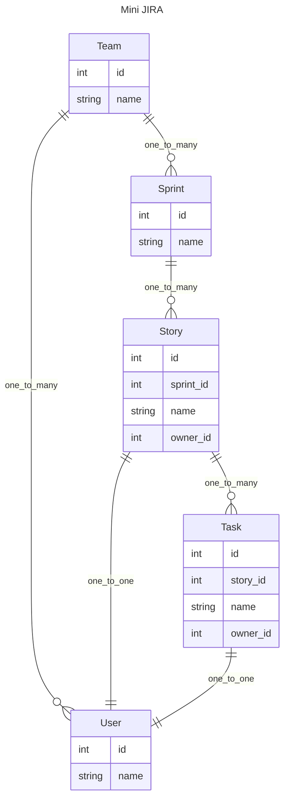

# 面向组合的 API 开发模式

构建面向视图的数据时, 不可避免会出现数据拼接的场景. 根据视图数据的复杂程度, 拼接的难度会有很大的差异.

```json
[
  {
    "id": 1,
    "team": "a",
    "members": [
      {
        "id": 1,
        "name": "kikodo",
        "task": [
          {
            "id": 1,
            "name": "complete tutorial"
          }
        ]
      }
    ],
  }
]
```

在处理手段上来讲, 通常的做法是手动循环着处理. 或者在一些特定场景下借助 ORM 来处理relationship 关系的查询.

```python
# 伪代码
task_map = group_by_member_id(tasks)
member_map = group_by_team_id(members)

for m in members:
  m.tasks = task_map[m.id]
for t in teams:
  t.members = member_map[t.id]
...
```

过程式的数据处理对调整和阅读都不友好, 循环和拼接容易产生不通用且不易维护的代码. 添加和修改也很麻烦.

GraphQL 带来的通过声明描述数据结构是一个好的方向, Graph Query Language, 作为一种声明式的查询语言, 服务于一系列特定资源的获取和组合. 从定位上来说, GraphQL 用来给项目的前端提供数据其实是一种错误的用法, 它的定位和 SQL 是类似的, 为服务端获取数据提供便利. 并且可以尽量不用考虑权限, 限速等问题. 

一段复杂的GraphQL query 和一段复杂的 ORM SQL 的功能很相似, 只是GraphQL更擅长组合数据. 在获取到了需要的视图数据之后, 再通过任意一种协议, 比如 http, 比如 rpc 等方式传递给前端使用. 前端作为展示层, 被动地使用后端接口数据即可. 现在很多前端直接使用 GraphQL 来组合查询, 从职位划分来说等于插手了一部分后端的工作. 把GraphQL 放在 client 和 server 之间并不是一个理想的定位. 就像把 SQL 查询暴露给 client 一样. (对数据的管理分散在多个环节不利于项目维护.)

GraphQL 的思路是通过 Query 确定最终的查询结构, 一层层驱动后端的 resolver 来构造数据.

完整引入 GraphQL 对架构调整的侵入不小, schema 定义之类的都要跟随调整. 而且其自身也存在一系列的问题, 例如:

- 无法描述尺寸不确定的递归结构
- key 不确定的 Dict 结构
- Query 比较复杂的话, 性能问题不容易优化.
- 数据的后处理不方便
- 要使用它定义的一套类型

等等.

总体来说, GraphQL 在提供视图数据方面, 有查询灵活度高的优点, 但存在获取的数据后期调整比较麻烦, 以及架构侵入较大等缺点. 比如 GraphQL 获取到多层数据后要做层级聚合统计, 就需要重新便利一遍树状数据来处理. 框架本身没有设计合适的下层数据处理完之后触发回调的钩子. (这恰恰是对视图调整很有用的)

思考后会发现, 其实我并不需要GraphQL 那个灵活的查询组合功能. 在处理视图数据的时候, GraphQL 最大的启发是他申明式的数据描述方式.

以 graphene-python 为例, Query对象可以支持灵活的 GraphQL 查询, 比如挑选字段, 或者重命名等等.

并且随着功能的添加, Query 里面会增加越来越多的内容.

```python
from graphene import ObjectType, String, Schema

class Query(ObjectType):
    hello = String(first_name=String(default_value="stranger"))
    goodbye = String()

    def resolve_hello(root, info, first_name):
        return f'Hello {first_name}!'

    def resolve_goodbye(root, info):
        return 'See ya!'
schema = Schema(query=Query)

query_with_argument = '{ hello(firstName: "GraphQL") }'
result = schema.execute(query_with_argument)
print(result.data['hello'])
```

那如果我并不需要去编写查询, 而是直接把 Query 直接当成一个描述语句来使用呢? 那我不就省下了额外描述的成本了?

```python
from pydantic import BaseModel
from pydantic_resolve import Resolver

class HelloGoodByeView(BaseModel):
  hello: str = ''
  def resolve_hello(self, context):
    return f"Hello {context['first_name']}"

  goodbye: str = ''
  def resolve_goodbye(self):
    return 'See ya'

async def main():
  hgv = HelloGoodByeView()
  return await Resolver(context={'first_name': 'tangkikodo'}).resolve(hgv)
```

面向 schema 进行定制化的描述. 借助 pydantic 强大的类型转换和检查的功能, 来实现申明式的数据结构描述.

**优点就是把大而全的单一查询入口, 替换成了一个个小巧灵活的定制化 schema 描述.**

在减小了scope的同时, 获得了对数据操控的巨大空间.

> 基于 schema 的声明式描述让整个结构摆脱了 GraphQL 的架构约束, 只用常用的 type annotation 就把定义给实现了.
>
> 后端获得了灵活构造视图数据的能力, 甚至可以解放很多前端重新计算的开销. 理想状态下, 前端获得数据后直接开箱即用.


## 什么是面向组合的模式?

面向组合的开发模式就是在这个简单例子的基础上, 逐步扩展出来的一套开发模式. 

核心概念就是在`根数据`的基础上, 描述每一层需要的扩展的字段和查询方式, 然后交给 `Resolver` 来填充所有的数据.

罗列一下, 这套开发模式有以下这些能力:

- 可以方便的描述组合体数据的 schema, 然后resolve出完整数据, 定义方式简单 (借助 pydantic or dataclass)
- 任意层级, 任意类型.
- 可以读取全局参数, 可以跨层级向下传递数据
- 每一层都有后处理数据的能力
- 可以挑选所需的字段
- 解决 N+1 查询相关的性能问题
- 架构简单, 各个 service 仅需提供通用的 loader, 用于数据拼装
- 借助OpenAPI, 前端对后端操作简化为sdk 方法调用.
- 调整视图数据很容易, 让前端真正做到开箱即用.
- 对优化友好, 只要保证输出一致, 内部重构对API使用者无感.


> 可以很容易联想到, 我们获得了一个 API 提供一个page 所需数据的能力, 这会让前后端接口关系变得更简单.
> 
> 就像前端通过 GraphQL 实现的那样, 但是会更简单, 不用写额外查询, 直接一个简单请求就行.

下图简单的展示了组合模式的关系, 分为 service 和 router 两个部分.

- service 负责一个个具体业务对象, 对外提供业务`query` 以及通用的数据 `loader`. 
- router 负责拼接 `schema`, 然后将 `query` 提供的核心数据, 通过自动解析, 生成完整的数据.


本 repo 会通过一系列的例子, 结合 `pydantic2-resolve` 和一些约定, 来介绍这么一套面向组合的 API 开发模式.

- https://github.com/allmonday/pydantic2-resolve


## 示例：搭建 Mini JIRA API



Mini jira 包含了常见的敏捷开发中的各种概念和其之间的关系.

我们将通过各种 `router/schema` 来描述并获得我们期望的数据结构, 这个过程将非常简洁.

比如下例中, 通过定义 Sample1StoryDetail 来生成 story -> task -> user 这样的多层数据.

只需要描述好 Task 要扩展的字段, Story 要扩展的字段, 然后 Resolver 就会帮你处理完后续的所有事情.

```python
from typing import Optional
from pydantic2_resolve import LoaderDepend as LD

# loaders
import src.services.task.loader as tl
import src.services.user.loader as ul

# schemas
import src.services.story.schema as ss
import src.services.task.schema as ts

# compose together
class Sample1TaskDetail(ts.Task):
    user: Optional[us.User] = None
    def resolve_user(self, loader=LD(ul.user_batch_loader)):
        return loader.load(self.owner_id)

class Sample1StoryDetail(ss.Story):
    tasks: list[Sample1TaskDetail] = []
    def resolve_tasks(self, loader=LD(tl.story_to_task_loader)):
        return loader.load(self.id)

    owner: Optional[us.User] = None
    def resolve_owner(self, loader=LD(ul.user_batch_loader)):
        return loader.load(self.owner_id)

# query
@route.get('/stories-with-detail', response_model=List[Sample1StoryDetail])
async def get_stories_with_detail(session: AsyncSession = Depends(db.get_session)):
    stories = await sq.get_stories(session)
    stories = [Sample1StoryDetail.model_validate(t) for t in stories]
    stories = await Resolver().resolve(stories)
    return stories
```

具体请参看 router 下的一系列 sample_x 或者滚动到底部阅读文档.


## 执行代码

```shell
python -m venv venv
source venv/bin/activate
pip install -r requirement.txt
uvicorn src.main:app --port=8000 --reload
# http://localhost:8000/docs
```

可以在 swagger 中执行查看每个 API 的返回值

## 功能介绍

- [Example 1: 多层嵌套结构的构建](./src/router/sample_1/readme-cn.md)
- [Example 2: Loader 的进阶用法](./src/router/sample_2/readme-cn.md)
- [Example 3: 跨层级数据获取](./src/router/sample_3/readme-cn.md)
- [Example 4: 每层数据的后处理](./src/router/sample_4/readme-cn.md)
- [Example 5: 利用 Context 和 Schema 实现复用](./src/router/sample_5/readme-cn.md)
- [Example 6: 挑选字段](./src/router/sample_6/readme-cn.md)
- [Example 7: 直接操作 Loader 实例](./src/router/sample_7/readme-cn.md)
- [更灵活的测试: 用service测试代替 API 测试](./src/services/sprint/readme-cn.md)
- [其他: 和 GraphQL 比较](./resolve-vs-graphql-cn.md)
