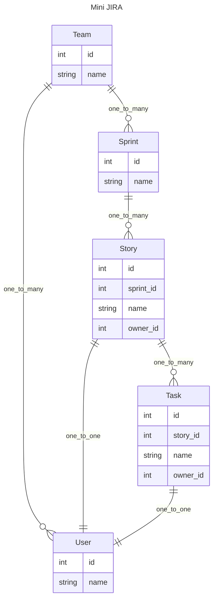
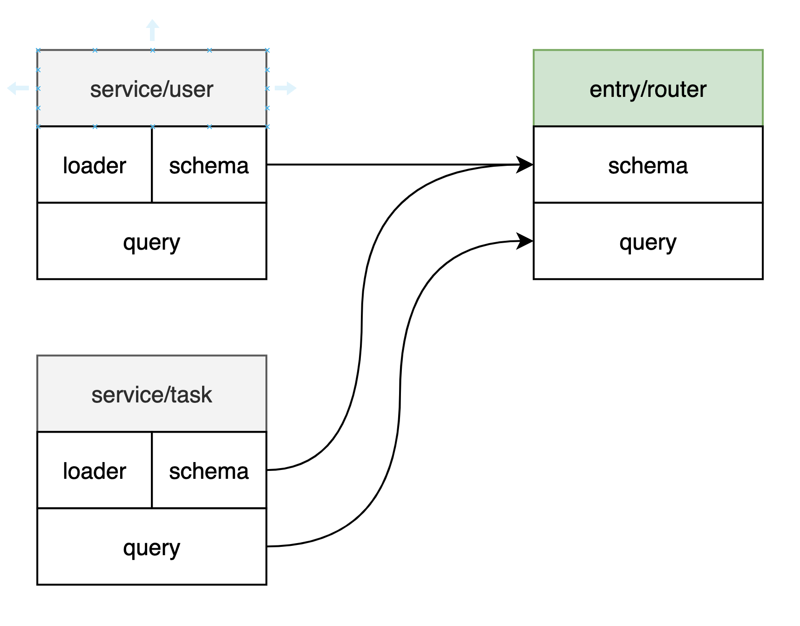

# 面向组合的 API 开发模式

在构建关系型数据的 API 时, 面对层层嵌套的数据, 是否有一个兼顾灵活, 性能, 以及可维护的方案? 

它应该能够支持以下功能:
- 异步
- 定义多层的数据结构, 方式要简洁, **轻松扩展关联数据**
- 传入全局参数给子孙节点
- 提供每层`resolve` 完子孙数据后, 操作数据的能力
- 挑选所需的返回字段
- 从子孙节点层层往上构建的能力
- 避免 N+1 查询相关的性能问题
- 友好的错误提醒, 方便debug

本 repo 会通过一系列的例子, 通过`pydantic2-resolve` 和一些约定, 来实现这么一套面向组合的API开发模式.

## Roadmap:

- ~~简单列表~~
- ~~嵌套列表~~
- ~~多层嵌套列表~~
- ~~Dataloader 的复用~~
- 各种配置 & 使用场景
- Dataloader 的预加载
- 面向可组合模式的一些约定

## 搭建 Mini JIRA API

让我们从一个 mini-jira 系统开始.

`mini-jira` 有这么些实体概念，分配到了各个 service 中。



## 执行代码

```shell
python -m venv venv
source venv/bin/activate
pip install -r requirement.txt
uvicorn src.main:app --port=8000 --reload
# http://localhost:8000/docs
```
可以在swagger中执行查看每个API的返回值

目录结构

- src 
    - routers
        - sample_1
            - router.py
            - schema.py // composed schema
        - sample_2
    - services
        - user
            - query.py // basic queries
            - loader.py  // dataloaders
            - model.py // sqlalchemy orm
            - schema.py  // base schema
            - mock.py
        - task
        - ...
    - main.py

## 简单列表

对应的路由:

- `sample_1.router:get_users`
- `sample_1.router:get_tasks`

在`src.router.sample_1` 中，我们依次创建 users, tasks 的 API， 以`list[T]`的形式返回。

```python
import src.services.task.query as tq

@route.get('/tasks', response_model=List[ts.Task])
async def get_step_1_tasks(session: AsyncSession = Depends(db.get_session)):
    """ 1.2 return list of tasks """
    return await tq.get_tasks(session)
```

通过引入 `src.services.user.query` 和 `src.services.task.query` 中的查询,返回了 `list[orm]` 对象, 然后 FastAPI 会自动将对象转成 `response_model` 中对应的类型.

## 嵌套列表

接下来我们要将将 `user` 信息添加到 `task` 中, 在`sample_1` 目录下创建 `schema.py`, 定义一个扩展了 `user` 信息的 `Sample1TaskDetail` 类型.

> 为了避免类型名字重复,使用 router 名字作为前缀
>
> 因此 Sample1 开头的 schema 都是属于 sample_1 路由的 (这点在生成前端 sdk ts 类型的时候会很有用.)

```python
class Sample1TaskDetail(ts.Task):
    user: Optional[us.User] = None
    def resolve_user(self, loader=LoaderDepend(ul.user_batch_loader)):
        return loader.load(self.owner_id)
```

几个注意点:

1. 继承`ts.Task`后, `Sample1TaskDetail` 就可以用 `tq.get_tasks(session)` 返回的 orm 对象赋值.
2. 定义 user 需要添加默认值, 否则用 `Sample1TaskDetail.model_valiate` 会报缺少字段错误.
3. `ul.user_batch_loader` 会根据 `list[task.owner_id]` 来关联 task 和 user 对象. 具体看 `src.services.user.loader`

> resolve 返回的数据只要是 `pydantic` 可以转化的类型就行. 如果是orm 对象需要配置 `ConfigDict(from_attribute=True)`

在 `router.py` 中, 依然是通过 `tq.get_tasks(session)` 来获取初始数据, 接着转换成 `Sample1TaskDetail`. 之后交给 `Resolver` 就能 `resolve` 出所有 `user` 信息.

```python
@route.get('/tasks-with-detail', response_model=List[Sample1TaskDetail])
async def get_tasks_with_detail(session: AsyncSession = Depends(db.get_session)):
    """ 1.3 return list of tasks(user) """
    tasks = await tq.get_tasks(session)
    tasks = [Sample1TaskDetail.model_validate(t) for t in tasks]
    tasks = await Resolver().resolve(tasks)
    return tasks
```

整个结构:


## 多层嵌套列表

使用相同的方式， 我们从 `tasks-with-details` 构建到了 `teams-with-details`. 虽然是层层嵌套，但定义的方式非常简单。

```python
class Sample1StoryDetail(ss.Story):
    tasks: list[Sample1TaskDetail] = []
    def resolve_tasks(self, loader=LoaderDepend(tl.story_to_task_loader)):
        return loader.load(self.id)

class Sample1SprintDetail(sps.Sprint):
    stories: list[Sample1StoryDetail] = []
    def resolve_stories(self, loader=LoaderDepend(sl.sprint_to_story_loader)):
        return loader.load(self.id)

class Sample1TeamDetail(tms.Team):
    sprints: list[Sample1SprintDetail] = []
    def resolve_sprints(self, loader=LoaderDepend(spl.team_to_sprint_loader)):
        return loader.load(self.id)
```

## Dataloader 的复用

Dataloader 的作用收集完所有要查询的 parent_ids 之后，一次性查询到所有的 childrent 对象，接着根据 child 的 parent_id 聚合起来。

数据关系可能有 1:1, 1:N, M:N, 从 parent 角度看的话，就会只有 1:1 和 1:N 两种。 对应这两种情况，`pydantic2-resolve` 提供了两个辅助函数

```python
from pydantic2_resolve import build_list, build_object

# service.user.loader:  1 - 1
async def user_batch_loader(user_ids: list[int]):
    async with db.async_session() as session:
        users = await batch_get_users_by_ids(session, user_ids)
        return build_object(users, user_ids, lambda u: u.id)

# service.sprint.loader:  1 - N
async def team_to_sprint_loader(team_ids: list[int]):
    async with db.async_session() as session:
        sprints = await batch_get_sprint_by_ids(session, team_ids)
        return build_list(sprints, team_ids, lambda u: u.team_id)
```

可以看到 1:1 的关系查询 id 是目标的主键， 查询非常简单, 因此可复用性最高。

而 1:N 的查询需要有对应的关系表来确定，所以复用情况受限于 parent 类型。

### 1:1

用 story 举例， `story.owner_id` 指定了一个 story 的负责人， 如果需要把 user 信息添加到 story, 则只需直接复用 `user_batch_loader` 方法。

```python
class Sample1StoryDetail(ss.Story):
    tasks: list[Sample1TaskDetail] = []
    def resolve_tasks(self, loader=LoaderDepend(tl.story_to_task_loader)):
        return loader.load(self.id)

    owner: Optional[us.User] = None
    def resolve_owner(self, loader=LoaderDepend(ul.user_batch_loader)):
        return loader.load(self.owner_id)
```

可以在 swagger 中查看输出。

### 1:N

以 teams 举例， team_user 表维护了 team 和 user 之间的关系。
所以我们的 loader 需要 join team_user 来查询 user.

因此这种类型的 dataloader 的复用是跟着 parent 类型走的.

```python
# team -> user
async def batch_get_user_by_team_ids(session: AsyncSession, team_ids: list[int]):
    stmt = (select(tm.TeamUser.team_id, User)
            .join(tm.TeamUser, tm.TeamUser.user_id == User.id)
            .where(tm.TeamUser.team_id.in_(team_ids)))
    rows = (await session.execute(stmt))
    return rows

async def team_to_user_loader(team_ids: list[int]):
    async with db.async_session() as session:
        pairs = await batch_get_user_by_team_ids(session, team_ids)
        dct = defaultdict(list)  # 因为是 1 - N 所以default 是 list
        for pair in pairs:
            dct[pair.team_id].append(pair.User)
        return [dct.get(team_id, []) for team_id in team_ids]
```

然后去 `sample_1.schema:Sample1TeamDetail` 中添加 members 以及刚刚创建的 loader 即可.

```python

class Sample1TeamDetail(tms.Team):
    sprints: list[Sample1SprintDetail] = []
    def resolve_sprints(self, loader=LoaderDepend(spl.team_to_sprint_loader)):
        return loader.load(self.id)

    members: list[us.User] = []
    def resolve_members(self, loader=LoaderDepend(ul.team_to_user_loader)):
        return loader.load(self.id)
```

> 顺便一提, `resolve_method` 并不需要从顶层class就开始定义. `Resolver` 会递归遍历然后找到`resolver_method` 进行解析.

至此， Dataloader 的复用性就介绍完了。


## 各种配置 & 使用场景

### Filter
进入 `sample_2`.

考虑这么一种场景, 需要列出 team 中 level 为 senior (或者其他值) 的 members, 那么 loader 需要提供添加过滤条件的手段.

我们可以这么做, 在 `src.services.user.loader` 中添加 `UserByLevelLoader`, 它有一个类属性 `level`. 在初始化 loader 之后, 通过设置 `self.level` 就能实现功能, 现在问题是怎么为 `self.level` 赋值.

> 一个 loader 实例的 filter 字段值是不可改变的. 不同的 filter 组合需要对应到各自的 loader 实例

```python

# team -> user (level filter)
class UserByLevelLoader(DataLoader):
    level: str = ''

    async def batch_load_fn(self, team_ids: list[int]):
        async with db.async_session() as session:
            stmt = (select(tm.TeamUser.team_id, User)
                    .join(tm.TeamUser, tm.TeamUser.user_id == User.id)
                    .where(tm.TeamUser.team_id.in_(team_ids))
                    .where(User.level == self.level))  # <--- filter
            pairs = (await session.execute(stmt))
            dct = defaultdict(list)
            for pair in pairs:
                dct[pair.team_id].append(pair.User)
            return [dct.get(team_id, []) for team_id in team_ids]
```

这个参数可以从 Resolver 中传入, `loader_filters` 中指定要设置参数的 DataLoader 子类和具体参数, 在内部执行时就会赋值过去.

```python
teams = await tmq.get_teams(session)
teams = [Sample2TeamDetail.model_validate(t) for t in teams]
teams = await Resolver(loader_filters={
    ul.UserByLevelLoader: {
        "level": 'senior'
    }
}).resolve(teams)
return teams
```


### Expose

进入 `sample_3`.

第二种情况, 我想让 task 又一个 full_name 字段, 直接包含所有层级的前缀. 比如 team_a -> sprint_a -> story_a -> task_a, 那么 task_a 的 full_name就是 `team_a/sprint_a/story_a/task_a`

schema 可以通过 `__pydantic_resolve_expose__ = {'name': 'team_name'}` 这样的方式, 给自己的某个字段取别名, 然后暴露给自己所有的子孙节点.

> 别名需要保证全局 (整个Resolve scope) 唯一.

反过来在任意子孙节点, 都能够通过 ancestor_context 参数, 来读取到直接祖先的 `name` 字段的值.

```python
class Sample3TeamDetail(tms.Team):
    __pydantic_resolve_expose__ = {'name': 'team_name'}  # expose name

    sprints: list[Sample3SprintDetail] = []
    def resolve_sprints(self, loader=LoaderDepend(spl.team_to_sprint_loader)):
        return loader.load(self.id)

class Sample3TaskDetail(ts.Task):
    ...

    full_name: str = ''
    def resolve_full_name(self, ancestor_context: Dict):
        team = ancestor_context['team_name']
        sprint = ancestor_context['sprint_name']
        story = ancestor_context['story_name']
        return f"{team}/{sprint}/{story}/{self.name}"
```

## Post hooks

进入 `sample_4` 

这次我想让 team, sprint, story 上面添加 task_count 字段, 来统计每一个级别包含的 task 总数. 

使用 `post_method` 可以做到, `post_method` 会在class 的所有 `resolve_methods` 执行完之后, 以同步的方式执行.

> 是的, 作为post hook, 它不支持 async

```python
class Sample4StoryDetail(ss.Story):
    tasks: list[Sample4TaskDetail] = []
    def resolve_tasks(self, loader=LoaderDepend(tl.story_to_task_loader)):
        return loader.load(self.id)
    
    task_count: int = 0
    def post_task_count(self):
        return len(self.tasks)
    
class Sample4SprintDetail(sps.Sprint):
    stories: list[Sample4StoryDetail] = []
    def resolve_stories(self, loader=LoaderDepend(sl.sprint_to_story_loader)):
        return loader.load(self.id)

    task_count: int = 0
    def post_task_count(self):
        return sum([s.task_count for s in self.stories])

class Sample4TeamDetail(tms.Team):
    sprints: list[Sample4SprintDetail] = []
    def resolve_sprints(self, loader=LoaderDepend(spl.team_to_sprint_loader)):
        return loader.load(self.id)

    task_count: int = 0
    def post_task_count(self):
        return sum([s.task_count for s in self.sprints])
```

从 Story 开始, 每一层都定义了一个 `task_count` 字段, 然后 `post_task_count` 会在 `tasks` 数据获取到之后执行, 计算出 `self.task` 的长度

等所有 post 方法执行完后, 才代表 Sprint 中的 `resolve_stories` 执行完毕, 接着 Sprint 中的 `post_task_count` 开始执行, 把所有 story 的 task_count 相加.

在往上 Team 也是类似的逻辑.

最后就能计算出每一层中的 task_count.

顺带一提, 在 post 方法中, 有一个特殊的方法 `post_default_handler`, 它会在所有的 `post_method` 执行完后再执行. 用它我们可以做一些有趣的功能:

比如我们可以为 Team 添加一个 description, 来总结 team 有多少task. 因为 `default_post_handler` 会在 resolve 和 post 执行完之后才执行, 所以就能获得所有信息 (task_count) 来生成 description.

```python
class Sample4TeamDetail(tms.Team):
    sprints: list[Sample4SprintDetail] = []
    def resolve_sprints(self, loader=LoaderDepend(spl.team_to_sprint_loader)):
        return loader.load(self.id)

    task_count: int = 0
    def post_task_count(self):
        return sum([s.task_count for s in self.sprints])
    
    description: str = ''
    def post_default_handler(self):
        self.description = f'team: {self.name} has {self.task_count} tasks in total.' 
```