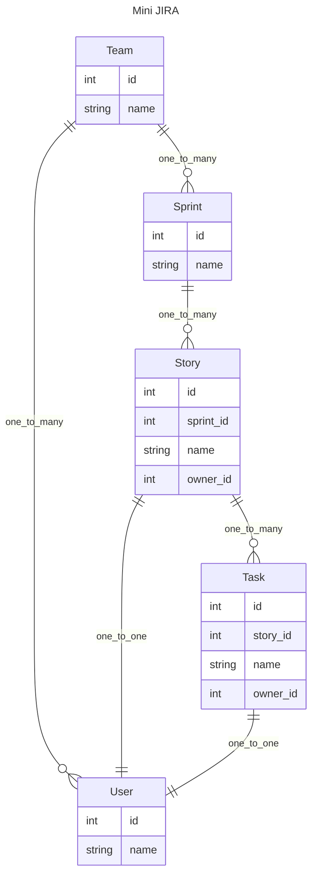

# Composition-oriented pattern for API development

[chinese](./readme-cn.md)

When building APIs for relational data, we are always faced with layers of nested data and ever-changing business requirements.

Is there a solution that combines flexibility, performance, and maintainability?

This solution should support the following features:

- asynchronous
- The definition of multi-layer data structures and can easily expand related data
- global context, scoped context
- The ability for each layer to have a hook to operate the data after the descendant data are resolved
- Pick the required fields
- Avoid N+1 queries
- Convenient for debugging

This repo will implement such a solution through a series of examples, with pydantic2-resolve and some conventions.

- https://github.com/allmonday/pydantic-resolve
- https://github.com/allmonday/pydantic2-resolve

## What is composition-oriented pattern?

In daily development, in order to obtain data with complex structures, we often choose to assemble the data after multiple requests from the client, or construct complex queries in the service.

If requirements changes, the query at the client or service layer will also need to be adjusted accordingly.

This change pollutes the ideal layered design and make changes happen in the service/client.

The current popular approach is using GraphQL, but the introduction cost of the entire solution is not low for the backend. Additionally, the frontend needs to manually write queries to describe fields, which lacks the smooth experience of directly using RPC-like requests.

The combination-oriented development pattern is to solve this problem.

By using pydantic2-resolve, and some conventions.

The `router layer` is responsible for building the schema to encapsulate changes, thereby avoiding changes in service and client.

In the cases of this repo, there are two directories:

`Services` and `Routers`.

`Services` are mainly responsible for a certain business service, it includes:

- Schema definition
- Business query
- Dataloaders

`Routers` return the required data by combining `[query, schema, loader]` from multiple services.

> The concept router here is mostly like `controller`, handling the composition of schemas is it's core function
>
> This demo is based on FastAPI, so I'll call it router instead.

This composition approach enables the flexible combination of generic services with specific business logic, allowing the service to quickly and concisely construct routers/APIs that meet the requirements of the business, and keeps services stable (unchanged) at the same time.


For example, in the following example, `Sample1StoryDetail` is composed of multiple schemas + loaders. The Story data inherited by `Sample1StoryDetail` is provided by the business query.

```python
from typing import Optional
from pydantic2_resolve import LoaderDepend

# loaders
import src.services.task.loader as tl
import src.services.user.loader as ul
import src.services.story.loader as sl
import src.services.sprint.loader as spl

# schemas
import src.services.story.schema as ss
import src.services.task.schema as ts
import src.services.user.schema as us
import src.services.sprint.schema as sps
import src.services.team.schema as tms

# compose together
class Sample1TaskDetail(ts.Task):
    user: Optional[us.User] = None
    def resolve_user(self, loader=LoaderDepend(ul.user_batch_loader)):
        return loader.load(self.owner_id)

class Sample1StoryDetail(ss.Story):
    tasks: list[Sample1TaskDetail] = []
    def resolve_tasks(self, loader=LoaderDepend(tl.story_to_task_loader)):
        return loader.load(self.id)

    owner: Optional[us.User] = None
    def resolve_owner(self, loader=LoaderDepend(ul.user_batch_loader)):
        return loader.load(self.owner_id)

# query
@route.get('/stories-with-detail', response_model=List[Sample1StoryDetail])
async def get_stories_with_detail(session: AsyncSession = Depends(db.get_session)):
    # fetching root data from query
    stories = await sq.get_stories(session)
    # load it into Resolvable schema
    stories = [Sample1StoryDetail.model_validate(t) for t in stories]
    # resolve it
    stories = await Resolver().resolve(stories)
    # done
    return stories
```

## Run code

```shell
python -m venv venv
source venv/bin/activate
pip install -r requirement.txt
uvicorn src.main:app --port=8000 --reload
# http://localhost:8000/docs
```

You can execute it in swagger to view the return value of each API

## Building mini JIRA API

Let's start with a mini-jira system. (ERD)



## Features & Scenarios

- [Construction of multi-layer nested structures](./src/router/sample_1/readme.md)
- [Data filtering in Loader](./src/router/sample_2/readme.md)
- [Exposing fields to descendant nodes](./src/router/sample_3/readme.md)
- [After resolved, post-processing of obtaining data](./src/router/sample_4/readme.md)
- [Reuse of Loaders](./src/router/sample_5/readme.md)
- [Picking the fields to be returned](./src/router/sample_6/readme.md)
- [Loader instance](./src/router/sample_7/readme.md)
- [Service testing is enough](./src/services/sprint/readme.md)
- [Compare to GraphQL](./resolve-vs-graphql.md)
