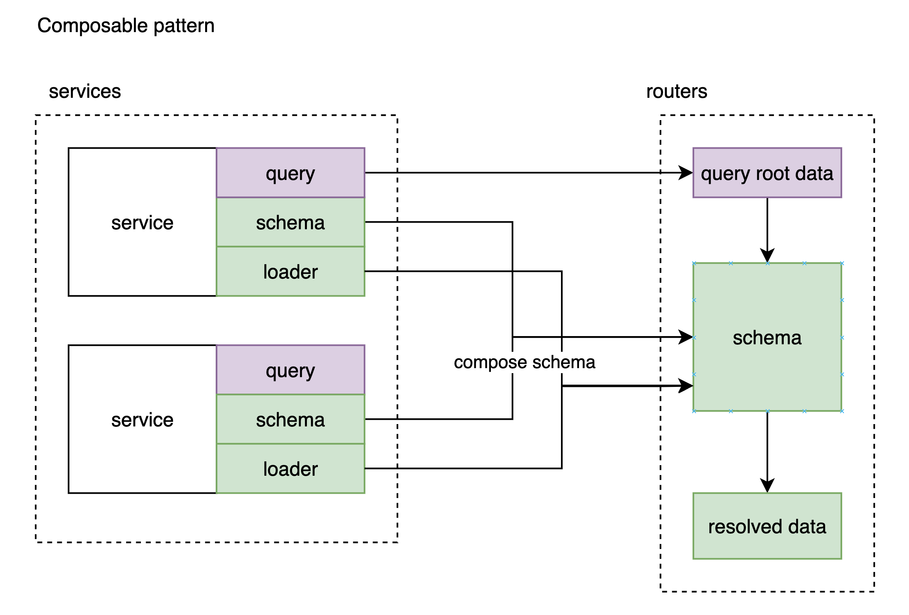
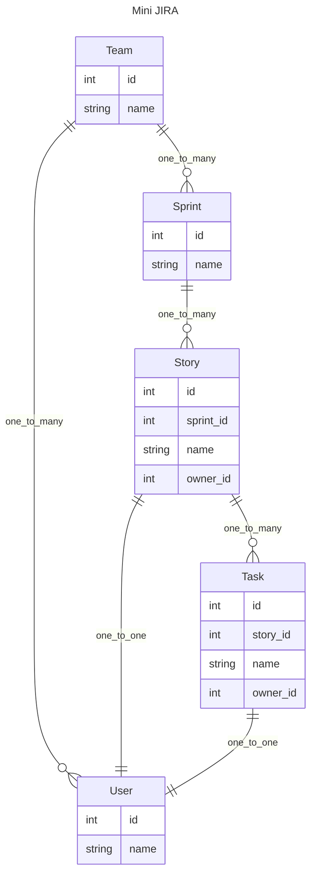

# 面向组合的 API 开发模式 [en](./en.md)

在构建关系型数据的 API 时, 面对层层嵌套的数据和随时变化的业务需求.

是否存在一个兼顾灵活, 性能, 以及可维护的解决方案?

它应该能够支持以下功能:

- 支持异步
- 支持定义多层的数据结构, **能够轻松扩展关联数据**
- 全局参数, 局部参数
- 提供每层`resolve` 完子孙数据后, 有个 hook 来操作数据的能力
- 挑选所需的字段
- 避免 N+1 查询相关的性能问题
- 友好的错误提醒, 方便 debug

本 repo 会通过一系列的例子, 通过`pydantic2-resolve` 和一些约定, 来实现这么一套面向组合的 API 开发模式.

## 什么是面向组合的模式?

在日常开发中, 为了获取复杂结构的数据, 我们常常会选择 client 多次请求后拼装, 或者在 service 中构建复杂查询来实现.

这时如果要求的数据发生了变化, 那么 client 或者 service 层的查询也要跟着调整.

这种变化污染了理想的分层设计, 把对业务的改动侵入到了 service 之中.

现在流行的思路是借助 graphql, 但整套方案的引入成本对后端来说并不低. 并且前端还需要手写 query 来描述字段, 没有直接 rpc-like 的请求体验顺畅. (rpc-like 可以参考 openapi + typescript-openapi-codegen)

面向组合的开发模式就是为了解决这个问题, 通过使用 `pydantic2-resolve` 让 router 层负责构建 schema 来封装变化, 从而避免 service 和 client 的改动.

在本 repo 的案例中, 有 services 和 routers 两个目录.

services 主要负责某一种业务服务的:

- schema 定义
- 业务 query (业务 root 数据的查询, 可以理解成还未拼装关联数据的主数据.)
- dataloader (服务于数据拼装)

routers 则通过**组合**多个 service 的 query + (schema + loader) 来返回需要的数据.

这种组合方式可以实现通用服务和具体业务之间的自由组合, 从 service 简洁快速的构建出满足业务需求的 router/API.



比如下例中, `Sample1StoryDetail` 就是由多个 schema + loader 组成的.
而 `Sample1StoryDetail` 继承的 Teams 数据由业务 query 来提供.

```python
from typing import Optional
from pydantic2_resolve import LoaderDepend

# loaders
import src.services.task.loader as tl
import src.services.user.loader as ul
import src.services.story.loader as sl
import src.services.sprint.loader as spl

# schemas
import src.services.story.schema as ss
import src.services.task.schema as ts
import src.services.user.schema as us
import src.services.sprint.schema as sps
import src.services.team.schema as tms

# compose together
class Sample1TaskDetail(ts.Task):
    user: Optional[us.User] = None
    def resolve_user(self, loader=LoaderDepend(ul.user_batch_loader)):
        return loader.load(self.owner_id)

class Sample1StoryDetail(ss.Story):
    tasks: list[Sample1TaskDetail] = []
    def resolve_tasks(self, loader=LoaderDepend(tl.story_to_task_loader)):
        return loader.load(self.id)

    owner: Optional[us.User] = None
    def resolve_owner(self, loader=LoaderDepend(ul.user_batch_loader)):
        return loader.load(self.owner_id)

# query
@route.get('/stories-with-detail', response_model=List[Sample1StoryDetail])
async def get_stories_with_detail(session: AsyncSession = Depends(db.get_session)):
    stories = await sq.get_stories(session)
    stories = [Sample1StoryDetail.model_validate(t) for t in stories]
    stories = await Resolver().resolve(stories)
    return stories
```

## 执行代码

```shell
python -m venv venv
source venv/bin/activate
pip install -r requirement.txt
uvicorn src.main:app --port=8000 --reload
# http://localhost:8000/docs
```

可以在 swagger 中执行查看每个 API 的返回值

## 搭建 Mini JIRA API

让我们从一个 mini-jira 系统开始.

`mini-jira` 有这么些实体概念，分配到了各个 service 中。



## 功能介绍

- [多层嵌套结构的构建](./src/router/sample_1/readme.md)
- [Loader 中对数据过滤](./src/router/sample_2/readme.md)
- [将字段暴露给子孙节点](./src/router/sample_3/readme.md)
- [resolve 结束后, 对获取数据的后处理](./src/router/sample_4/readme.md)
- [Loader 的复用](./src/router/sample_5/readme.md)
- [挑选需要返回的字段](./src/router/sample_6/readme.md)
- [反向拼装数据-wip](./src/router/sample_7/readme.md)
- [用 service 测试代替 API 测试-wip](./src/services/sprint/readme.md)
