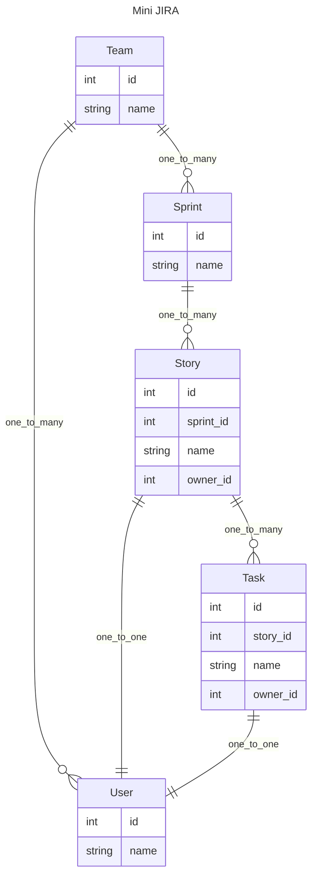

# Composition-oriented pattern for API development

[chinese](./readme-cn.md)

When building an API for relational data, we are faced with layers of nested data and ever-changing business requirements.

Is there a solution that combines flexibility, performance, and maintainability?

It should be able to support the following features:

- Support asynchronous
- Supports the definition of multi-layer data structures and can easily expand related data
- global parameters, local parameters
- Provides the ability for each layer resolve to have a hook to operate the data after completing the descendant data.
- Pick the required fields
- Avoid performance issues related to N+1 queries
- debug Friendly error reminder, convenient for debugging

This repo will implement such a combination-oriented API development model through a series of examples, through pydantic2-resolve and some conventions.

- https://github.com/allmonday/pydantic-resolve
- https://github.com/allmonday/pydantic2-resolve

## What is composition-oriented pattern?

In daily development, in order to obtain data with complex structures, we often choose to assemble the data after multiple requests from the client, or construct complex queries in the service.

If the required data changes at this time, the query at the client or service layer will also need to be adjusted accordingly.

This change pollutes the ideal layered design and intrudes changes to the business into the service.

The current popular approach is to use GraphQL, but the introduction cost of the entire solution is not low for the backend. Additionally, the frontend needs to manually write queries to describe fields, which lacks the smooth experience of directly using RPC-like requests.

The combination-oriented development model is to solve this problem. By using pydantic2-resolve , the router layer is responsible for building the schema to encapsulate changes, thereby avoiding changes to service and client.

In the case of this repo, there are two directories: services and routers.

Services are mainly responsible for a certain business service:

- schema definition
- Business query (query of business root data, can be understood as master data that has not yet assembled associated data.)
- dataloader (serves data assembly)

Routers return the required data by combining query + (schema + loader) of multiple services.

This composition approach enables the flexible combination of generic services with specific business logic, allowing the service to quickly and concisely construct routers/APIs that meet the requirements of the business.


For example, in the following example, Sample1StoryDetail is composed of multiple schemas + loaders. The Story data inherited by Sample1StoryDetail is provided by the business query.

```python
from typing import Optional
from pydantic2_resolve import LoaderDepend

# loaders
import src.services.task.loader as tl
import src.services.user.loader as ul
import src.services.story.loader as sl
import src.services.sprint.loader as spl

# schemas
import src.services.story.schema as ss
import src.services.task.schema as ts
import src.services.user.schema as us
import src.services.sprint.schema as sps
import src.services.team.schema as tms

# compose together
class Sample1TaskDetail(ts.Task):
    user: Optional[us.User] = None
    def resolve_user(self, loader=LoaderDepend(ul.user_batch_loader)):
        return loader.load(self.owner_id)

class Sample1StoryDetail(ss.Story):
    tasks: list[Sample1TaskDetail] = []
    def resolve_tasks(self, loader=LoaderDepend(tl.story_to_task_loader)):
        return loader.load(self.id)

    owner: Optional[us.User] = None
    def resolve_owner(self, loader=LoaderDepend(ul.user_batch_loader)):
        return loader.load(self.owner_id)

# query
@route.get('/stories-with-detail', response_model=List[Sample1StoryDetail])
async def get_stories_with_detail(session: AsyncSession = Depends(db.get_session)):
    stories = await sq.get_stories(session)
    stories = [Sample1StoryDetail.model_validate(t) for t in stories]
    stories = await Resolver().resolve(stories)
    return stories
```

## Run code

```shell
python -m venv venv
source venv/bin/activate
pip install -r requirement.txt
uvicorn src.main:app --port=8000 --reload
# http://localhost:8000/docs
```

You can execute it in swagger to view the return value of each API

## Building mini JIRA API

Let's start with a mini-jira system.

`mini-jira` There are so many entity concepts allocated to each service.



## Features

- [Construction of multi-layer nested structures](./src/router/sample_1/readme.md)
- [Data filtering in Loader](./src/router/sample_2/readme.md)
- [Expose fields to descendant nodes](./src/router/sample_3/readme.md)
- [After resolved, post-processing of obtaining data](./src/router/sample_4/readme.md)
- [Loader reuse](./src/router/sample_5/readme.md)
- [Select the fields to be returned](./src/router/sample_6/readme.md)
- [Loader instance](./src/router/sample_7/readme.md)
- [Use service testing instead of API testing-wip](./src/services/sprint/readme.md)
- [Compare to GraphQL](./resolve-vs-graphql.md)
