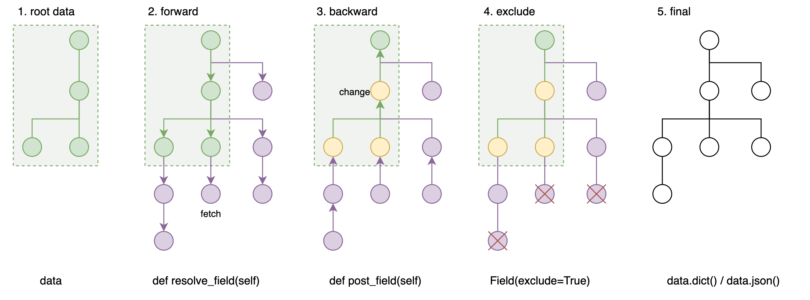
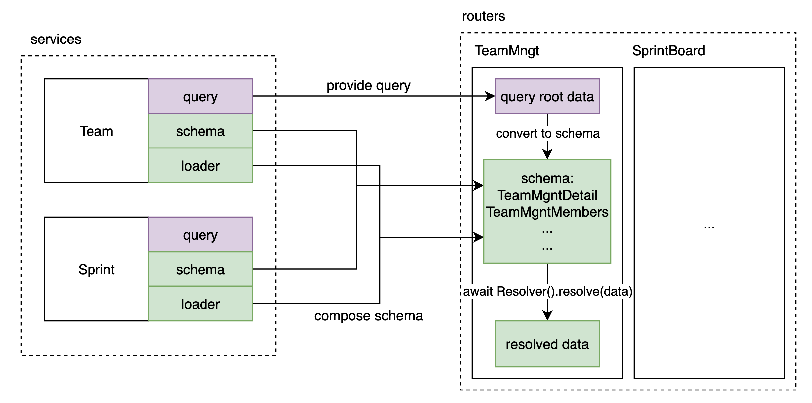

# 面向组合的 API 开发模式 

**让 ER model 始终清晰可见**

[english version](./readme-en.md)


> 使用面向组合的开发模式，写出更容易维护， 更好分析的业务逻辑。 

本 repo 会通过一系列的例子, 结合 [pydantic-resolve](https://github.com/allmonday/pydantic-resolve) 和一些约定, 来介绍这套面向组合的 API 开发模式.  


## 示例：搭建 Mini JIRA API


Mini jira 包含了常见的敏捷开发中的各种概念和其之间的关系.

我们将通过各种 `router/schema` 来描述并获得我们期望的数据结构, 这个过程将非常简洁.

比如下例中, 通过定义 Sample1StoryDetail 来生成 story -> task -> user 这样的多层数据.

只需要描述好 Task 要扩展的字段, Story 要扩展的字段, 然后 Resolver 就会帮你处理完后续的所有事情.

```python
from typing import Optional
from pydantic_resolve import LoaderDepend as LD

# loaders
import src.services.task.loader as tl
import src.services.user.loader as ul

# schemas
import src.services.story.schema as ss
import src.services.task.schema as ts

# compose together
class Sample1TaskDetail(ts.Task):
    user: Optional[us.User] = None
    def resolve_user(self, loader=LD(ul.user_batch_loader)):
        return loader.load(self.owner_id)

class Sample1StoryDetail(ss.Story):
    tasks: list[Sample1TaskDetail] = []
    def resolve_tasks(self, loader=LD(tl.story_to_task_loader)):
        return loader.load(self.id)

    owner: Optional[us.User] = None
    def resolve_owner(self, loader=LD(ul.user_batch_loader)):
        return loader.load(self.owner_id)

# query
@route.get('/stories-with-detail', response_model=List[Sample1StoryDetail])
async def get_stories_with_detail(session: AsyncSession = Depends(db.get_session)):
    stories = await sq.get_stories(session)
    stories = [Sample1StoryDetail.model_validate(t) for t in stories]
    stories = await Resolver().resolve(stories)
    return stories
```

output:

```json
[
  {
    "id": 1,
    "name": "deliver a MVP",
    "owner_id": 1,
    "sprint_id": 1,
    "tasks": [
      {
        "id": 1,
        "name": "mvp tech design",
        "owner_id": 2,
        "story_id": 1,
        "user": {
          "id": 2,
          "name": "Eric",
          "level": "junior"
        }
      },
      {
        "id": 2,
        "name": "implementation",
        "owner_id": 2,
        "story_id": 1,
        "user": {
          "id": 2,
          "name": "Eric",
          "level": "junior"
        }
      },
      {
        "id": 3,
        "name": "tests",
        "owner_id": 2,
        "story_id": 1,
        "user": {
          "id": 2,
          "name": "Eric",
          "level": "junior"
        }
      },
      {
        "id": 4,
        "name": "code review",
        "owner_id": 2,
        "story_id": 1,
        "user": {
          "id": 2,
          "name": "Eric",
          "level": "junior"
        }
      }
    ],
    "owner": {
      "id": 1,
      "name": "John",
      "level": "senior"
    }
  }
]
```


## 执行代码

```shell
python -m venv venv
source venv/bin/activate
pip install -r requirement.txt
uvicorn src.main:app --port=8000 --reload
# http://localhost:8000/docs
```

可以在 swagger 中执行查看每个 API 的返回值

## 功能介绍

- [Example 1: 多层嵌套结构的构建](./src/router/sample_1/readme.md)
- [Example 2: Loader 的进阶用法](./src/router/sample_2/readme.md)
- [Example 3: 跨层级数据获取](./src/router/sample_3/readme.md)
- [Example 4: 每层数据的后处理](./src/router/sample_4/readme.md)
- [Example 5: 利用 Context 和 Schema 实现复用](./src/router/sample_5/readme.md)
- [Example 6: 挑选字段](./src/router/sample_6/readme.md)
- [Example 7: 直接操作 Loader 实例](./src/router/sample_7/readme.md)
- [更灵活的测试: 用service测试代替 API 测试](./src/services/sprint/readme.md)
- [其他: 和 GraphQL 比较](./resolve-vs-graphql.md)
- [使用openapi codegen和前端集成](./fe-demo/readme.md)


## 来龙去脉

构建面向视图的数据时, 不可避免会出现组装数据的需求.

```json
[
  {
    "id": 1,
    "team": "a",
    "members": [
      {
        "id": 1,
        "name": "kikodo",
        "task": [
          {
            "id": 1,
            "name": "complete tutorial"
          }
        ]
      }
    ],
  }
]
```

根据视图数据的复杂程度, 拼接的难度会有很大的差异.

在处理手段上来讲, 通常的做法是手动循环拼接. 

```python
# 伪代码
task_map = group_by_member_id(tasks)
member_map = group_by_team_id(members)

for m in members:
  m.tasks = task_map[m.id]
  for t in teams:
    t.members = member_map[t.id]
    ...

```

> 或者在一些特定场景下借助 ORM 来处理relationship 关系的查询.

过程式的数据处理对调整和阅读都不友好, 循环和拼接容易产生不通用和不易维护的代码. 添加和修改字段也很麻烦.

另外这种处理放在不同的分层, 影响也不同. 比如常用的 controller - service - model 三层:

- 如果由 model 来处理, 那么 model 层需要做修改, controller 和 service 都要跟着调整
- 如果由 service 处理, 那么 service 的查询就会充满视图细节, 不容易复用, service 就变得僵化了
- 如果由 controller 处理, 影响面较小, 但这种命令式的拼接本身不直观, 不好维护
- 如果让 client 处理, 那会是个灾难.

面向组合模式将会在 controller 层解决这个拼接问题.

GraphQL 带来的通过声明描述数据结构是一个好的方向, Graph Query Language, 作为一种声明式的查询语言, 服务于一系列关系型资源的获取和组合.  其查询语句能展示期望的数据结构. 

```gql
{
  project(name: "GraphQL") {
    tagline
  }
}
```

背后的Query定义也是用申明的方式来描述(可能用来查询的)数据结构.

```js
// schema first
var schema = buildSchema(`
  type Query {
    hello: String
  }
`)

var rootValue = {
  hello: () => {
    return "Hello world!"
  },
}
```

借用 code first 的 graphene 的会更加形象一些.

```python
# code first
from graphene import ObjectType, String, Schema

class Query(ObjectType):
    hello = String(first_name=String(default_value="stranger"))

    def resolve_hello(root, info, first_name):
        return f'Hello {first_name}!'
```

一段复杂的GraphQL query 查询结果和一段复杂的 ORM 查询是类似的. 只是GraphQL 借助 dataloader 隐藏了关联数据的获取细节. 可以更加直观地构造多层的视图数据. (代价是额外的查询开销)

GraphQL 虽好, 但完整引入 GraphQL 对架构的影响不小, schema 定义之类的都要跟随调整. 而且其自身也存在一系列的问题, 例如:
- 无法描述尺寸不确定的递归结构
- key 不确定的 Dict 结构
- Query 比较复杂的话, 性能问题不容易优化.
- Query 的维护是个问题
- 数据的后处理不方便
- 要使用它定义的一套类型


> 个人认为, 从定位上来说, GraphQL 用来给项目的前端提供数据其实是一种错误的用法, 它的定位和 SQL 是类似的, 为服务端获取数据提供便利. 这样就可以不用考虑权限, 限速等接口层问题. 
>
> 现在很多前端直接使用 GraphQL 来组合查询, 从职位划分来说等于插手了一部分后端的工作. 把GraphQL 放在 client 和 server 之间并不是一个理想的定位. 就像把 SQL 查询暴露给 client 一样. (数据的处理分散在多个环节不利于项目维护.)


总体来说, GraphQL 在提供视图数据方面, 有查询灵活度高的优点, 但存在获取的数据后期调整比较麻烦, 以及架构侵入较大等缺点. 比如 GraphQL 获取到多层数据后要做层级聚合统计, 就需要重新遍历一遍树状数据来处理. 框架本身没有设计合适的下层数据处理完之后触发回调的钩子. (这恰恰是对视图调整很有用的)

在这里我们暂停总结一下, 看看从数据获取到生成视图需要哪几个步骤.

1. 查询: 来源可能是多组数据, 也可能已经是嵌套数据
2. 数据拼接: (optinal), 根据 1 来决定是否需要 (GraphQL可以很大程度跳过这一步.)
3. 业务转换: 对查到的数据做调整, 比如计算数组长度, 额外过滤, 业务转换等等, 构造出前端直接可以使用的数据. (GraphQL不擅长这块)

思考后会发现, 相较 GraphQL 灵活的查询, 在处理视图数据的时候, GraphQL 最大的优势恰恰是他申明式的数据描述方式.

以 graphene-python 为例, Query可以灵活选择所需的字段

```python
from graphene import ObjectType, String, Schema

class Query(ObjectType):
    hello = String(first_name=String(default_value="stranger"))
    goodbye = String()

    def resolve_hello(root, info, first_name):
        return f'Hello {first_name}!'

    def resolve_goodbye(root, info):
        return 'See ya!'
schema = Schema(query=Query)

query_with_argument = '{ hello(firstName: "GraphQL") }'
result = schema.execute(query_with_argument)
print(result.data['hello'])
```

那如果我省去查询, 而是直接将 Query 变成一个固定的， class 描述的业务类型? 

借助 pydantic 强大的类型转换和检查的功能, 我们可以这样来实现申明式的数据结构描述.

```python
from pydantic import BaseModel
from pydantic_resolve import Resolver

class HelloGoodByeView(BaseModel):
  hello: str = ''
  def resolve_hello(self, context):
    return f"Hello {context['first_name']}"

  goodbye: str = ''
  def resolve_goodbye(self):
    return 'See ya'

  def post_goodbye(self):
    return 'See ya soon'  # will alter the self.goodbye.

async def main():
  hgv = HelloGoodByeView()
  return await Resolver(context={'first_name': 'tangkikodo'}).resolve(hgv)
```

这样, 我们就获得了一个专用的视图数据描述, 并且获得了期望的数据.

**把大而全的单一查询入口, 替换成了一个个小巧灵活的定制化 schema 描述.**

结合那三个步骤, `pydantic-resolve` 可以做到:

1. 查询. 可以层层查询 (dataloader), 也可以一次性从树状数据加载 (GraphQL or ORM 查询结果).
2. ~~数据拼接~~ 
3. 业务转换: 利用post_method, expose, exclude 等方法, 可以在每一层灵活处理数据

## 什么是面向组合的模式?

面向组合的开发模式就是在**声明式描述期望视图结构**的基础上, 逐步扩展出来的一套面向视图数据查询的开发模式. 

它在架构上的优势是, 通过申明式的 schema 定义, 让数据拼接过程变得更加直接和容易调整. 

它让 service 层的核心数据查询保持简洁, 使用独立的数据loader来组合数据, 避免了拼接逻辑侵入到 service 或者 controller 的情况.

它的核心概念是: 

1. 定义好视图结构schema(从根数据的结构向下扩展)
2. 获取`根数据`(树干), 转换成schema
3. 让`Resolver`遍历解析出来所有的数据 (树枝,树叶).

resolve过程包含了 forward fetch, backward change 和 exclude fields 三个环节.




> 根数据本身当然也可以是嵌套的结构

罗列一下, 这套开发模式有以下这些优点:

- 查询
  - 用申明式的方式描述数据和查询, 直观且容易修改
  - 简化`根数据`的查询, 避免复杂sql 语句对可读性的影响.
  - 可以读取全局参数, 可以跨层级向下传递数据
  - 任意层级, 任意类型.
  - 架构简单, 各个 service 仅需提供通用的 loader, 用于数据拼装
- 调整 
  - 每一层都有后处理数据的能力
  - 可以挑选字段, 可以隐藏字段
  - 直接满足前端所需的复杂结构 (而且比client端调整更方便)
- 性能
  - 避免 N+1 查询相关的性能问题
  - 对优化友好, 重构的依赖阻碍小.
- 其他
  - 借助OpenAPI, 前端对后端操作简化为sdk 方法调用.
  - 借助typescript 让前后端调整变得易如反掌

> 可以很容易联想到, 我们获得了单个 API 提供一个page 所需数据的能力, 这会让前后端接口关系变得更简单.
> 
> 就像前端通过 GraphQL 实现的那样, 而且更简单, 数据直接可用, 不用写额外查询, 直接一个简单请求就行.

下图简单的展示了组合模式的关系, 分为 service 和 router(controller) 两个部分.

- service 负责一个个具体业务对象 `schema`, 对外提供业务`query` 以及通用的数据 `loader`. 
- router 负责声明面向组合的视图 `schema`




## 总结

走完了所有的Example 之后, 你也许会发现, 尽管我们在 router 的schema 中组合出来了各种结构的数据, services 目录下的文件始终保持了相当程度的简洁和稳定, 这是组合模式最大的优点, 分离了业务中的稳定和不稳定的部分.

每个 service 模块通过暴露自己的:
- query, 业务查询
- mutation, 业务操作
- schema, 拼装类型
- loader, 关联数据

就能满足 router 层视图 schema 的所有需要.

这感觉就像, 盒子中的积木虽然有无数种组合可能, 我们只需要挑选组装出我们所需的那一种.

query 可以专注在**主数据**的查询上, 这样降低了查询的复杂度, 进而使得核心业务逻辑的可维护性得到提升. 测试也更加容易覆盖.

loader 提供各种关联数据, 既可以从数据库查询, 也可以走RPC调用, 为后续架构调整保留了弹性. 于是从单体架构转变为微服务的过程会减少许多阻力.

使用这样的组合功能, 将各个 service 提供的数据, 用申明的方式组织起来, 在提升开发效率的同时, 最大程度保证了业务代码的可读和可维护. 

另外, 每一个接口都可以自己按需继承 service 的 schema, 这保证了类型互相之间充分的独立性, 也为每个接口后续的优化提供了充分的空间, 不用担心改动会影响到其他接口. 可以在需求稳定之后, 重写一些重要的接口. 这样既能在前期摸索阶段快速实现功能, 也能在后期巩固阶段游刃有余.

在测试方面, 只要 service 级别实现充分的测试覆盖, 那么 router 层许多的功能组合是完全不用写测试的. 这无疑减少了许多工作量. (数据源可靠 + 组合过程靠可 => 生成的视图数据可靠)

最后需要说明一下, pydantic-resolve 负责了按层级展开的数据获取和调整的过程, 使得开发只需要专注在每一层如何获取子数据, 以及如何在获取子数据之后进行修改. 所以平时冗长的for 循环展开都消失不见了, 在减少了代码噪音之后, 我们就能更加专注在核心功能上了.


最后依然使用这张示意图来作为结尾.


最后的最后, 读到这里, 您可能发现, 这套模式, 看起来还挺适合 BFF 的 :)
> 当然, python 不是 BFF 的主流选择, 这个是个硬伤, 也许未来可以开发一套nodejs 版本的.

完.

Enjoy.
